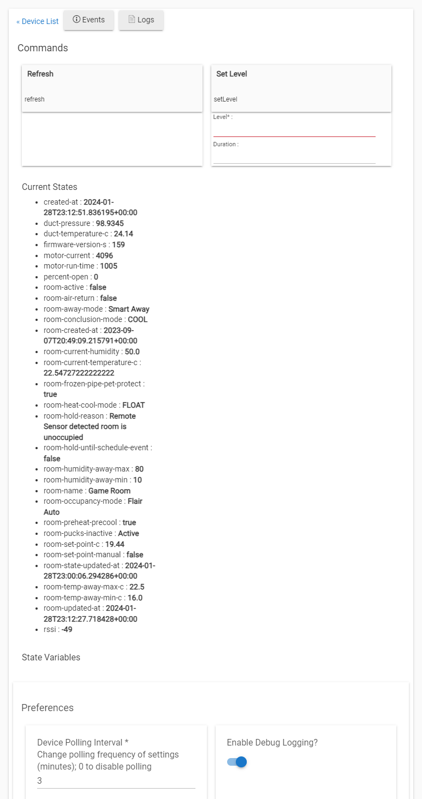

# Hubitat Driver for Flair Smart Vents

This app allows you to control [Flair Smart Vents](https://flair.co/) in [Hubitat](https://hubitat.com/).

## Key Features
The Hubitat integration for Flair Smart Vents provides several useful features:

### Dynamic Airflow Balancing (Beta)
The dynamic airflow balancing feature optimizes vent positions to reach and maintain the target temperature, while minimizing vent adjustments.

It calculates the rate of temperature change for each room based on vent positions. It then sets the vents only as open as needed to reach the thermostat setpoint in sync.

This reduces noise and wear from vent motors constantly adjusting. It also maximizes battery life by keeping the vents steady.

### Granular Control
You can set the exact vent open percentage, not just rely on Flair's auto-balancing.

Control the vents from 0-100% open via Hubitat dashboard, rules, or through Alexa/Google voice control when linked.

### Remote Control
Control your vents and view status remotely through the Hubitat mobile app.

### Presence Integration
Link vent automation to presence sensors. Close vents when away to save energy.

### Smart Scheduling
Use Hubitat's rules and schedules to open/close vents based on time of day or other triggers.

## Installation 

To install:

1. Install the Flair vent driver code:
   - In Hubitat hub go to **Drivers Code** > **New Driver**  
   - Copy and paste the [hubitat-flair-vents-driver.groovy](hubitat-flair-vents-driver.groovy) contents
   - Click **Save**

2. Install the Flair app code:
   - In Hubitat hub go to **Apps Code** > **New App**
   - Copy and paste the [hubitat-flair-vents-app.groovy](hubitat-flair-vents-app.groovy) contents
   - Click **Save**
   - Click **Add User App** under the app listing
   
3. Get credentials from Flair:
   - Submit a request to Flair via [this form](https://forms.gle/VohiQjWNv9CAP2ASA)
   - Flair will provide you a Client ID and Client Secret
   - Enter these into the Hubitat Flair app

4. Discover devices:
   - In the Hubitat app, click **Discover Devices**
   - Your Flair vents will be added automatically

The vents can now be controlled through the Hubitat dashboard.

## Usage

Each vent will appear as a separate device in Hubitat. 

You can control the vents by setting the **setLevel** attribute:

- `setLevel 0` - Close vent
- `setLevel 50` - Set vent to 50% open  
- `setLevel 100` - Fully open vent

The opening percentage will be reflected in the **level** attribute.
This allows automating vent open/close based on routines, presence, or other triggers.

You can control whether the room is active or not by setting **setRoomActive** attribute.

## Join the Discussion

https://community.hubitat.com/t/new-control-flair-vents-with-hubitat-free-open-source-app-and-driver/132728
