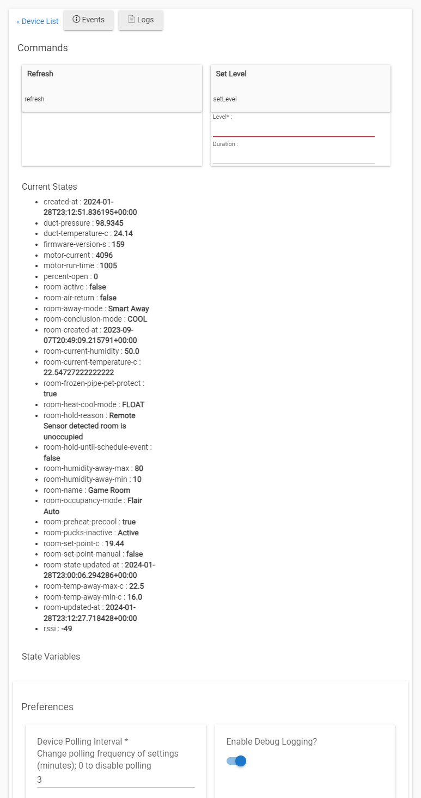

# Hubitat Integration for Flair Smart Vents

This app provides comprehensive control of [Flair Smart Vents](https://flair.co/) through [Hubitat](https://hubitat.com/), introducing intelligent and adaptive air management for your home's heating, ventilation, and air conditioning (HVAC) system.

## Key Features

### Dynamic Airflow Balancing
Harness the power of Dynamic Airflow Balancing to refine air distribution throughout your home. Achieve optimal temperatures with fewer vent adjustments, extending the lifespan of vent motors and conserving battery life. Benefits include:
- **Rate of temperature change calculation** in each room for precise vent adjustment.
- **Reduced adjustments** mean less wear on vent motors and quieter operation.
- **Minimum airflow compliance** to prevent HVAC issues from insufficient airflow, particularly useful when integrating Flair Smart Vents with traditional vents.

Two strategies are available:
- **Legacy DAB** — the original strategy; the default for existing installs.
- **DAB v2 "balance"** — a synchronized-convergence allocator with learned per-room/per-vent efficiency, airflow-limited cross-coupling, an inviolable airflow safety floor, and optional per-room door/occupancy inputs. It is the default for new installs and is parity-gated against a validated reference implementation. DAB v2 also adds opt-in per-room and zone-summary diagnostic devices.

### Enhanced Vent Control and Combined Airflow Management
This integration doesn't just enable remote control over each Flair vent; it smartly manages airflow to ensure your HVAC system operates efficiently without damage. Key features include:
- **Precise control** over each vent, allowing you to set exact open levels for customized airflow.
- **Combined airflow management** calculates total airflow from both Smart and conventional vents, ensuring the system meets minimum airflow requirements to safeguard your HVAC system from underperformance or damage.

### Automation Capabilities
Unlock advanced automation with Rule Machine in Hubitat, creating rules to automatically control vent positions based on various triggers such as occupancy, time of day, or specific events. Examples include:
- **Room Use Optimization**: Automate vents to close in unoccupied rooms, focusing climate control where it's needed.
- **Schedule-Based Control**: Set vents to adjust based on time-of-day schedules, enhancing comfort and energy efficiency.

To automate room activity within Rule Machine:
1. Navigate to "Set Variable, Mode or File" > "Run Custom Action".
2. Choose a Flair vent device.
3. For the command, select "setRoomActive".
4. For the parameter, input "true" to activate a room or "false" to deactivate.

## Getting Started

### Install with Hubitat Package Manager (recommended)
The integration ships as a single Hubitat **Bundle** (app + Flair vents driver + Flair pucks driver + the DAB v2 library), so there are no separate files to paste in.
1. Install [Hubitat Package Manager](https://community.hubitat.com/t/release-hubitat-package-manager-hpm/94471) if you don't already have it.
2. In HPM, choose **Install > Search by Keywords**, search for **Flair Vents**, and install the package.
3. To try DAB v2 before it becomes the stable default, use HPM's **Beta / Early Release** option when installing or updating — this pulls the DAB v2 bundle.
4. Open the **Flair Vents** app, enter your API credentials, and discover devices (see below).

### Manual install (alternative)
1. **Install Flair Vent Driver**: In Hubitat, navigate to **Drivers Code > New Driver**, paste the contents of `hubitat-flair-vents-driver.groovy`, and save.
2. **Install Flair Pucks Driver**: Repeat under **Drivers Code > New Driver** with `hubitat-flair-vents-pucks-driver.groovy`.
3. **Install Flair App**: Access **Apps Code > New App**, copy and paste `hubitat-flair-vents-app.groovy`, click save, and then **Add User App** to install the Flair integration. (For DAB v2, also add the `FlairVentsDabv2` library under **Libraries Code**, since the app pulls it via `#include`.)
4. **Configure API Credentials**: Request and input Flair API credentials (Client ID and Client Secret) within the Hubitat Flair app setup interface.
5. **Discover Devices**: Initiate device discovery through the app to add your Flair vents.

## Using The Integration
Control and automation are at your fingertips. Each Flair vent appears as an individual device within Hubitat. You can:
- Set the **vent opening level** with `setLevel` (0 for closed, 100 for fully open).
- Manage **room activity** using the `setRoomActive` command to strategically manage airflow based on room usage.

### Manual mode and the local Puck dial

While Dynamic Airflow Balancing is enabled, it holds your Flair structure in **Manual mode** so it can position vents directly. Manual mode disables Flair's own automation, which means **turning the dial on a Flair Puck no longer changes the room set point** — local Puck setpoint control is unavailable while DAB-managed Manual mode is held. The Flair API exposes no toggle to re-enable the local Puck dial in this state, so this is a documented limitation rather than a configurable option. Set the room set point from Hubitat instead (for example with the per-room target/offset settings or the `setRoomSetpoint` command).

## Settings Reference (Dynamic Airflow Balancing)

All settings live in the Flair Vents app page once **Dynamic Airflow Balancing** is enabled. Defaults are sensible for most homes; out-of-range values are clamped to the documented bounds.

### Core

- **Choose Thermostat for Vents** — the controlling thermostat for the default zone. The app reads its *operating state* and *setpoint*; room temperatures come from each room's own Flair sensor (or a per-vent override, below).
- **Control Strategy** — `balance` (DAB v2, default for new installs) or the legacy strategy (default for existing installs until you opt in).
- **Airflow safety floor (%)** (default 40, range 20–90) — the combined-airflow minimum that protects the HVAC system. Inviolable: every other setting yields to it.
- **Minimum vent opening (%)** (default 0) — every balanced vent is commanded to at least this percentage. The safety floor and the inactive-room close take precedence.
- **Count of conventional Vents** (0–15) and **Conventional vent assumed open (%)** (default 100) — how many non-Flair vents share the system and how open they are assumed to be; both feed the combined-airflow math behind the safety floor.
- **Close vents on inactive rooms** (default on) — vents in rooms marked inactive are closed (never below the safety floor).
- **Vent Adjustment Granularity** (5/10/25/50/100%, default 5) — the grid vent targets are rounded to. Coarser = fewer, larger moves.

### Balancing behavior (DAB v2)

- **Spread guardrail (C)** (default 1.0) — if the predicted temperature spread across active rooms is already at or below this, the adjustment is skipped entirely. Bigger value = fewer vent moves, looser balance.
- **Spread improvement deadband (C)** (default 0.3) — new vent targets are only applied when they are predicted to shrink the spread by at least this much; filters out moves that barely help.
- **Enable duct cross-coupling** (default on) — when a room cannot keep up even with its vent nearly fully open, rooms that already reached their target close their vents to redirect air to it. Duct pressure/temperature readings veto the transfer when it would not help.
- **Airflow-limited margin (%)** (default 5) and **Airflow-limited error threshold (C)** (default 0.5) — when a room's vent is within the margin of its maximum useful opening but the room is still off target by more than the threshold, the room is flagged *airflow-limited* (the trigger for cross-coupling).
- **Active evaluation interval (min)** (default 3) and **Idle evaluation interval (min)** (default 10) — how often the balancing loop re-evaluates while the HVAC is conditioning vs. idle.
- **Short-cycle idle gap (min)** (default 10) — a restart in the same mode after an idle gap shorter than this reuses the previous cycle's vent allocation instead of recomputing (avoids churn on short-cycling systems).
- **Pre-adjust minimum idle dwell (min)** (default 5) — the system must have been idle at least this long before vents may be pre-positioned for the next expected cycle.
- **Pre-adjust trigger threshold (C)** (default 1.0) — pre-positioning happens only once at least one room has drifted back within this many degrees of the setpoint (a new cycle looks imminent). Together the two gates keep vents from moving on short idle blips.

### Fan-only circulation

- **Open vents during fan-only circulation** (default off) — when the thermostat reports fan-only operation (its operating state is `fan only`, or the fan mode is `on` while the system is idle), the zone's vents open to the circulation percentage instead of being left at their idle positions.
- **Circulation open percentage (%)** (10–100, default 50) — how far vents open while circulating.
- **Circulation debounce (s)** (0–600, default 60) — suppresses short fan bursts so vents don't thrash on rapid fan on/off flips.

### Optional inputs

- **Outdoor temp source** — adds outdoor temperature to the learning context so room efficiency is judged against conditions.
- **Whole-home door sensor / Occupancy source** — fallbacks used for rooms without their own signals.
- **Per-room door sensors** — map a contact sensor to a room so an open door only slows that room's airflow estimate (unmapped rooms use the whole-home fallback). Occupancy is taken per room from the Flair puck automatically.
- **Choose Thermostat for [vent]** (under Vent Options) — per-vent temperature-source override: use this device's reading as that vent's room temperature instead of the Flair sensor.

### Zones and diagnostics

- **Add a zone** — create one zone per HVAC system/thermostat. Each zone gets its own controlling thermostat, conventional-vent count, safety floor, and independent learning; each vent/puck belongs to at most one zone, and unassigned devices are left alone.
- **Create diagnostic devices** (default off) — creates one child device per room plus a zone-summary device exposing what the algorithm is thinking (proposed vent openings, learned rates, predicted spread). DAB v2 `balance` strategy only: devices appear on the first balance evaluation after enabling and refresh on every evaluation (about every 3 minutes while heating/cooling, every 10 while idle); turning the option off removes them. Values are the evaluation's proposals — the dispatch layer may still suppress a physical move through its anti-chatter gates. Purely informational; control is unaffected.

## Development & Testing

### Running Tests

This project includes a comprehensive test suite covering all critical algorithms:

```bash
# Run all tests
./gradlew test

# Run tests with coverage report
./gradlew clean test jacocoTestReport

# View test results
open build/reports/tests/test/index.html
open build/reports/jacoco/test/html/index.html
```

### Test Coverage

- **500+ test cases** covering both Dynamic Airflow Balancing strategies
- **Property-based tests** asserting the DAB v2 correctness properties (seeded, reproducible)
- **Parity tests** validating DAB v2 against a reference implementation via shared fixtures
- **Mathematical precision** validation for temperature calculations
- **Edge case testing** for robust error handling
- **Multi-room scenarios** with realistic HVAC data
- **Safety constraint validation** for minimum airflow requirements

See [TESTING.md](TESTING.md) for detailed testing documentation.

### Architecture

The integration features advanced **Dynamic Airflow Balancing (DAB)** algorithms:
- Temperature change rate learning per room
- Predictive vent positioning using exponential models
- Minimum airflow safety constraints (inviolable safety floor)
- Rolling average calculations for efficiency optimization
- DAB v2 synchronized-convergence allocation with airflow-limited cross-coupling

See [architecture.md](architecture.md) for the architecture and best-practices reference.

## Support and Community
Dive deeper into documentation, engage with community discussions, and receive support on the [Hubitat community forum thread](https://community.hubitat.com/t/new-control-flair-vents-with-hubitat-free-open-source-app-and-driver/132728).


